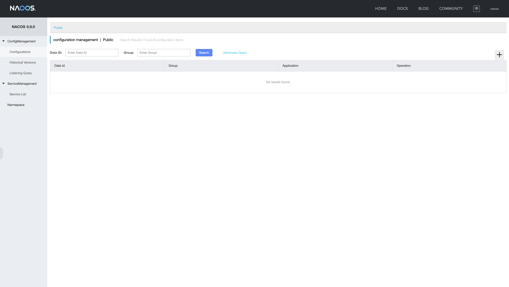
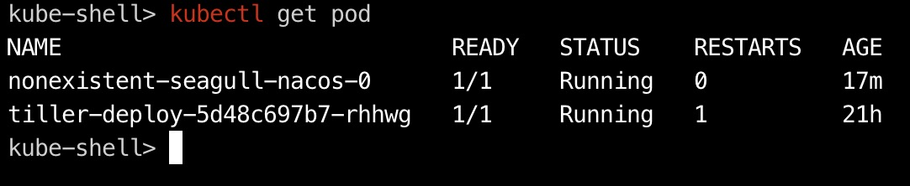
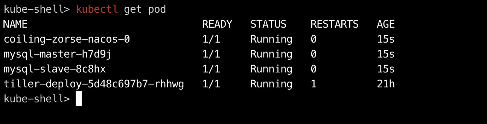
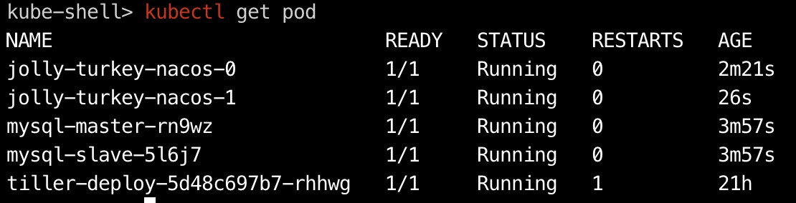
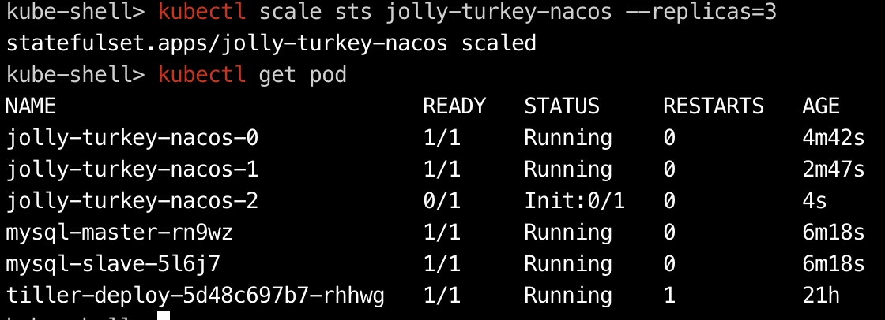
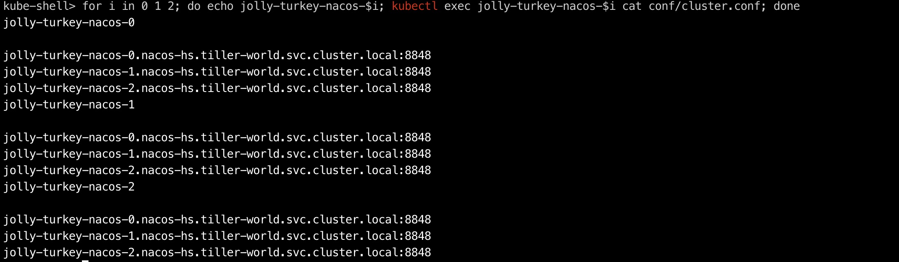

# Nacos Helm Chart

Nacos is committed to help you discover, configure, and manage your microservices. It provides a set of simple and useful features enabling you to realize dynamic service discovery, service configuration, service metadata and traffic management.

## Introduction

This project is based on the Helm Chart packaged by [nacos-k8s](https://github.com/nacos-group/nacos-k8s/).

## Prerequisites

 - Kubernetes 1.10+ 
 - Helm v3 
 - PV provisioner support in the underlying infrastructure

## Installing the Chart

To install the chart with `release name`:

```shell
$ helm install `release name` ./nacos
```

The command deploys Nacos on the Kubernetes cluster in the default configuration. It will run without a mysql chart and persistent volume. The [configuration](#configuration) section lists the parameters that can be configured during installation. 

### Service & Configuration Management

#### Service registration
```shell
curl -X POST 'http://$NODE_IP:$NODE_PORT/nacos/v1/ns/instance?serviceName=nacos.naming.serviceName&ip=20.18.7.10&port=8080'
```

#### Service discovery
```shell
curl -X GET 'http://$NODE_IP:$NODE_PORT/nacos/v1/ns/instance/list?serviceName=nacos.naming.serviceName'
```
#### Publish config
```shell
curl -X POST "http://$NODE_IP:$NODE_PORT/nacos/v1/cs/configs?dataId=nacos.cfg.dataId&group=test&content=helloWorld"
```
#### Get config
```shell
curl -X GET "http://$NODE_IP:$NODE_PORT/nacos/v1/cs/configs?dataId=nacos.cfg.dataId&group=test"
```


> **Tip**: List all releases using `helm list`

## Uninstalling the Chart

To uninstall/delete `release name`:

```shell
$ helm uninstall `release name`
```
The command removes all the Kubernetes components associated with the chart and deletes the release.

## Configuration

The following table lists the configurable parameters of the Skywalking chart and their default values.

| Parameter                             | Description                                                        | Default                             |
|---------------------------------------|--------------------------------------------------------------------|-------------------------------------|
| `global.mode`                         | Run Mode (quickstart, standalone, cluster; quickstart: without mysql and pv)   | `quickstart`            |
| `global.storageClass.provisioner`     | Global storage class provisioner                                   | `nil`                               |
| `mysql.resources`                     | The [resources] to allocate for mysql container                    | `{}`                                |
| `mysql.nodeSelector`                  | Mysql labels for mysql                  | `{}`                                |
| `mysql.affinity`                      | Mysql affinity policy                                              | `{}`                                |
| `mysql.tolerations`                   | Mysql tolerations                                                  | `{}`                                |
| `mysql.image.pullPolicy`              | Mysql container image pull policy                                  | `IfNotPresent`                      |
| `mysql.annotations`            | Mysql  annotations                                           | `{}`                                |
| `mysql.image.repository`       | Mysql  container image name                                  | `nacos/nacos-mysql`          |
| `mysql.image.tag`              | Mysql  container image tag                                   | `5.7`                            |
| `mysql.rootPassword`           | Mysql  root password                                         | `root`                              |
| `mysql.database`               | Nacos database name                                                | `nacos_devtest`                     |
| `mysql.user`                   | Nacos database user                                                | `nacos`                             |
| `mysql.password`               | Nacos database password                                            | `nacos`                             |
| `mysql.classParameters`        | Mysql  storageclass parameters                               | `{}`                                |
| `mysql.persistence.enabled`    | Enable the  data persistence or not                    | `false`                             |
| `mysql.persistence.existingClaim`|Use the existing PVC which must be created manually before bound, and specify the `subPath` if the PVC is shared with other components                                        | `mysql-data`        |
| `mysql.persistence.claim.name`      | Mysql  pvc name                                         | `mysql-data`                 |
| `mysql.persistence.claim.spec.accessModes` | Mysql  pvc access mode                           | `ReadWriteOnce`                     |
| `mysql.persistence.claim.spec.resources.requests.storage`  | Mysql  pvc requests storage      | `5G`                                |
| `mysql.persistence.claim.spec.storageClassName`|  Mysql  pvc storage class name               | `sc-mysql`                   |
| `mysql.service.port`           | Mysql  service port                                          | `3306`                              |
| `resources`                          | The [resources] to allocate for nacos container                    | `{}`                                |
| `nodeSelector`                       | Nacos labels for pod assignment                   | `{}`                                |
| `affinity`                           | Nacos affinity policy                                              | `{}`                                |
| `tolerations`                         | Nacos tolerations                                                  | `{}`                                |
| `resources.requests.cpu`|nacos requests cpu resource|`500m`|
| `resources.requests.memory`|nacos requests memory resource|`2G`|
| `replicaCount`                        | Number of desired nacos pods, the number should be 1 as run quickstart or standalone mode| `1`           |
| `image.repository`                    | Nacos container image name                                      | `nacos/nacos-server`                   |
| `image.tag`                           | Nacos container image tag                                       | `0.9.0`                                |
| `image.pullPolicy`                    | Nacos container image pull policy                                | `IfNotPresent`                        |
| `health.enabled`                      | Enable health check or not                                         | `false`                              |
| `env.preferhostmode`                  | Enable Nacos cluster node domain name support                      | `hostname`                         |
| `env.serverPort`                      | Nacos port                                                         | `8848`                               |
| `persistence.enabled`                 | Enable the nacos data persistence or not                           | `false`                              |
| `persistence.storageClassName`        | Nacos storage class name                                           | `sc-nacos`                   |
| `persistence.classParameters`                     | Nacos storageclass parameters                                      | `{}`
| `persistence.data.accessModes`					| Nacos data pvc access mode										| `ReadWriteOnce`		|
| `persistence.data.storageClassName`				| Nacos data pvc storage class name									| `manual`			|
| `persistence.data.resources.requests.storage`		| Nacos data pvc requests storage									| `5G`					|
| `persistence.plugin.accessModes`					| Nacos plugin pvc access mode (Available as cluster mode)			| `ReadWriteOnce`		|
| `persistence.plugin.storageClassName`				| Nacos plugin pvc storage class name (Available as cluster mode)	| `manual`			|
| `persistence.plugin.resources.requests.storage`	| Nacos plugin pvc requests storage (Available as cluster mode)		| `5G`					|
| `persistence.log.accessModes`						| Nacos log pvc access mode (Available as cluster mode)				| `ReadWriteOnce`		|
| `persistence.log.storageClassName`				| Nacos log pvc storage class name (Available as cluster mode)		| `manual`			|
| `persistence.log.resources.requests.storage`		| Nacos log pvc requests storage (Available as cluster mode)		| `5G`					|
| `service.type`									| http service type													| `NodePort`			|
| `service.port`									| http service port													| `8848`				|
| `service.nodePort`								| http service nodeport												| `30000`				|
| `service.rpcType`									| rpc service type													| `ClusterIP`			|
| `service.rpcPort`									| rpc service port													| `7848`				|
| `service.rpcNodePort`								| rpc service nodeport												| `30001`				|
| `ingress.enabled`									| Enable ingress or not												| `false`				|
| `ingress.annotations`								| The annotations used in ingress									| `{}`					|
| `ingress.hosts`									| The host of nacos service in ingress rule							| `nacos.example.com`	|


## Example

#### quickstart mode(without mysql)
```console
$ helm install `release name` ./ --set global.mode=quickstart
```


#### standalone mode(without pv)
```console
$ helm install `release name` ./ --set global.mode=standalone
```



> **Tip**: if the logs of nacos pod throws exception, you may need to delete the pod. Because mysql pod is not ready, nacos pod has been started.

#### cluster mode(without pv)
```console
$ helm install `release name` ./ --set global.mode=cluster
```


```console
$ kubectl scale sts `release name`-nacos --replicas=3
```


 * Use kubectl exec to get the cluster config of the Pods in the nacos StatefulSet after scale StatefulSets
 

