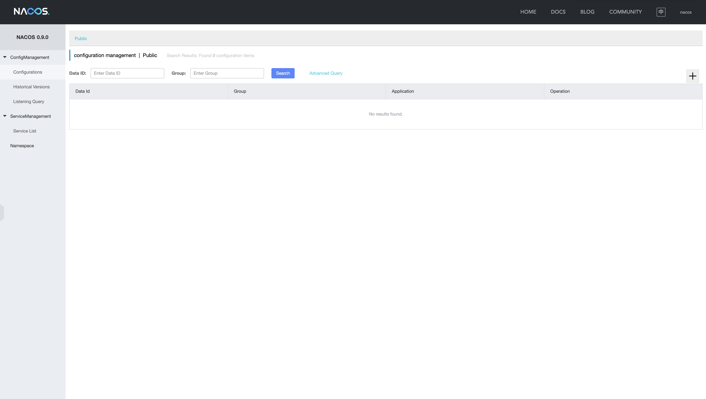
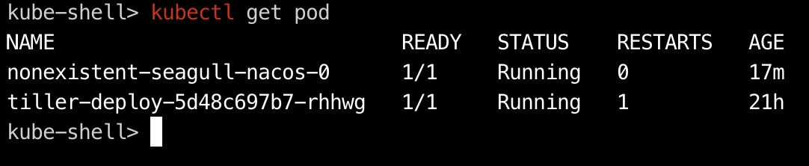
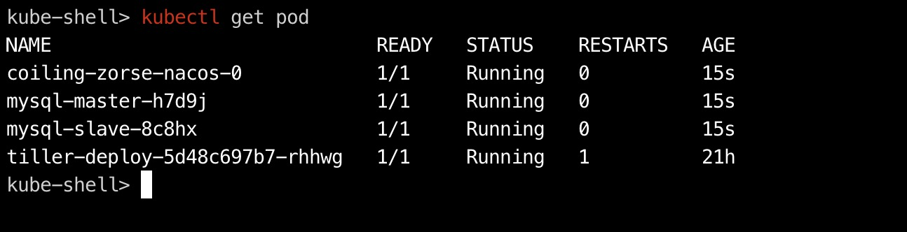
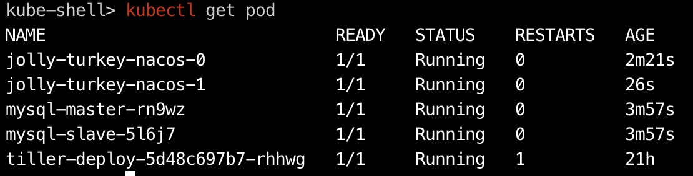
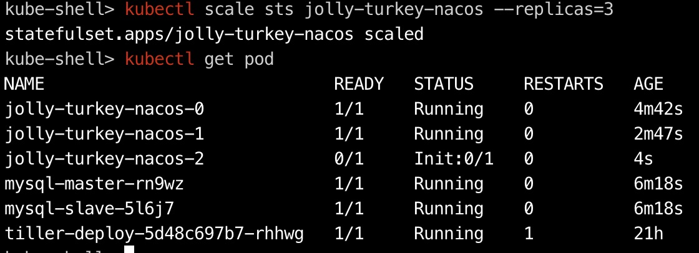
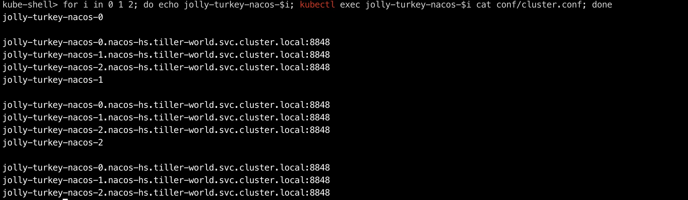

# Nacos Helm Chart

Nacos is committed to help you discover, configure, and manage your microservices. It provides a set of simple and useful features enabling you to realize dynamic service discovery, service configuration, service metadata and traffic management.

## Introduction

This project is based on the Helm Chart packaged by [nacos-k8s](https://github.com/nacos-group/nacos-k8s/).

## Prerequisites

 - Kubernetes 1.19+ 
 - Helm v3 
 - PV provisioner support in the underlying infrastructure

## Tips
If you use a custom database, please initialize the database script yourself first.
<https://github.com/alibaba/nacos/blob/develop/plugin-default-impl/nacos-default-datasource-plugin/nacos-datasource-plugin-mysql/src/main/resources/META-INF/mysql-schema.sql>

 
## Installing the Chart

To install the chart with `release name`:

```shell
$ kubectl create secret generic nacos-auth \
    --from-literal=token="${NACOS_AUTH_TOKEN}" \
    --from-literal=identity-key="${NACOS_AUTH_IDENTITY_KEY}" \
    --from-literal=identity-value="${NACOS_AUTH_IDENTITY_VALUE}"
$ helm install `release name` ./ --set nacos.auth.existingSecret=nacos-auth
```

The command deploys Nacos on the Kubernetes cluster in the default configuration. It will run without a mysql chart and persistent volume. The [configuration](#configuration) section lists the parameters that can be configured during installation.

When `nacos.auth.existingSecret` is empty, the chart creates a release-scoped Secret with generated credentials and reuses those values on subsequent Helm upgrades. Supplying an existing Secret is recommended for production so that credentials can be managed and backed up independently.

When upgrading from chart `1.0.0` or earlier, use `--reuse-values` for the first upgrade if the release still relies on the legacy inline `nacos.authToken`, `nacos.identityKey`, and `nacos.identityValue` values. The chart copies those retained values into its managed Secret. Alternatively, create an external Secret first and set `nacos.auth.existingSecret` during the upgrade.

The chart does not set `NACOS_AUTH_ENABLE` unless `nacos.auth.enabled` is explicitly `true` or `false`. Therefore, an unset value inherits the selected image's behavior: Nacos 3.3 and later enable Client API authentication by default, while earlier images keep their own defaults.

To keep Client API authentication disabled temporarily while upgrading existing clients to Nacos 3.3, set an explicit override:

```shell
$ helm upgrade `release name` ./ --reuse-values --set nacos.auth.enabled=false
```

This switch controls only Client API authentication. Admin and Console API authentication remain independent, and the authentication Secret is still mounted when Client API authentication is disabled.

### Service & Configuration Management

Log in first and copy `accessToken` from the response when Client API authentication is enabled:

```shell
curl -X POST 'http://$NODE_IP:$NODE_PORT/nacos/v3/auth/user/login' \
  -d 'username=nacos' -d "password=${NACOS_PASSWORD}"
```

#### Service registration
```shell
curl -X POST 'http://$NODE_IP:$NODE_PORT/nacos/v3/client/ns/instance?serviceName=nacos.naming.serviceName&ip=20.18.7.10&port=8080' \
  -H "accessToken: ${NACOS_ACCESS_TOKEN}"
```

#### Service discovery
```shell
curl -X GET 'http://$NODE_IP:$NODE_PORT/nacos/v3/client/ns/instance/list?serviceName=nacos.naming.serviceName' \
  -H "accessToken: ${NACOS_ACCESS_TOKEN}"
```
#### Publish config
```shell
curl -X POST "http://$NODE_IP:$NODE_PORT/nacos/v3/admin/cs/config?dataId=nacos.cfg.dataId&groupName=test&content=helloWorld" \
  -H "accessToken: ${NACOS_ACCESS_TOKEN}"
```
#### Get config
```shell
curl -X GET "http://$NODE_IP:$NODE_PORT/nacos/v3/client/cs/config?dataId=nacos.cfg.dataId&groupName=test" \
  -H "accessToken: ${NACOS_ACCESS_TOKEN}"
```


> **Tip**: List all releases using `helm list`

## Uninstalling the Chart

To uninstall/delete `release name`:

```shell
$ helm uninstall `release name`
```
The command removes all the Kubernetes components associated with the chart and deletes the release.

## Configuration

The following table lists the configurable parameters of the Nacos chart and their default values.

| Parameter                                       | Description                                                                                                | Default                                                                                         |
|-------------------------------------------------|------------------------------------------------------------------------------------------------------------|-------------------------------------------------------------------------------------------------|
| `global.mode`                                   | Run Mode (~~quickstart,~~ standalone, cluster; )                                                           | `standalone`                                                                                    |
| `resources`                                     | The [resources] to allocate for nacos container                                                            | `{}`                                                                                            |
| `nodeSelector`                                  | Nacos labels for pod assignment                                                                            | `{}`                                                                                            |
| `affinity`                                      | Nacos affinity policy                                                                                      | `{}`                                                                                            |
| `tolerations`                                   | Nacos tolerations                                                                                          | `{}`                                                                                            |
| `resources.requests.cpu`                        | nacos requests cpu resource                                                                                | `500m`                                                                                          |
| `resources.requests.memory`                     | nacos requests memory resource                                                                             | `2G`                                                                                            |
| `nacos.replicaCount`                            | Number of desired nacos pods, the number should be 1 as run standalone mode                                | `1`                                                                                             |
| `nacos.image.repository`                        | Nacos container image name                                                                                 | `nacos/nacos-server`                                                                            |
| `nacos.image.tag`                               | Nacos container image tag                                                                                  | `v3.2.3`                                                                                        |
| `nacos.image.pullPolicy`                        | Nacos container image pull policy                                                                          | `IfNotPresent`                                                                                  |
| `nacos.plugin.enable`                           | Nacos cluster plugin that is auto scale                                                                    | `true`                                                                                          |
| `nacos.plugin.image.repository`                 | Nacos cluster plugin image name                                                                            | `nacos/nacos-peer-finder-plugin`                                                                |
| `nacos.plugin.image.tag`                        | Nacos cluster plugin image tag                                                                             | `1.1`                                                                                           |
| `nacos.health.enabled`                          | Enable health check or not                                                                                 | `false`                                                                                         |
| `nacos.preferHostMode`                          | Enable Nacos cluster node domain name support                                                              | `hostname`                                                                                      |
| `nacos.serverPort`                              | Nacos pod's port                                                                                           | `8848`                                                                                          |
| `nacos.consolePort`                             | Nacos console main port                                                                                    | `8080`                                                                                          |
| `nacos.mcpPort`                                 | Nacos mcp registry port                                                                                    | `9080`                                                                                          |
| `nacos.auth.enabled`                            | Client API authentication override; `null` inherits the image default                                      | `null`                                                                                          |
| `nacos.auth.existingSecret`                     | Existing Secret containing the token and server identity; generated when empty                             |                                                                                                 |
| `nacos.auth.tokenSecretKey`                     | Key containing the Base64-encoded Nacos token secret                                                       | `token`                                                                                         |
| `nacos.auth.identityKeySecretKey`               | Key containing the Nacos server identity key                                                               | `identity-key`                                                                                  |
| `nacos.auth.identityValueSecretKey`             | Key containing the Nacos server identity value                                                             | `identity-value`                                                                                |
| `nacos.authToken`                               | Deprecated inline token value; prefer `nacos.auth.existingSecret`                                          |                                                                                                 |
| `nacos.identityKey`                             | Deprecated inline server identity key; prefer `nacos.auth.existingSecret`                                  |                                                                                                 |
| `nacos.identityValue`                           | Deprecated inline server identity value; prefer `nacos.auth.existingSecret`                                |                                                                                                 |
| `nacos.storage.type`                            | Nacos data storage method `mysql` or `embedded`. The `embedded` supports either standalone or cluster mode | `embedded`                                                                                      |
| `nacos.storage.db.host`                         | mysql  host                                                                                                |                                                                                                 |
| `nacos.storage.db.name`                         | mysql  database name                                                                                       |                                                                                                 |
| `nacos.storage.db.port`                         | mysql port                                                                                                 | 3306                                                                                            |
| `nacos.storage.db.username`                     | username of  database                                                                                      |                                                                                                 |
| `nacos.storage.db.password`                     | password of  database                                                                                      |                                                                                                 |
| `nacos.storage.db.param`                        | Database url parameter                                                                                     | `characterEncoding=utf8&connectTimeout=1000&socketTimeout=3000&autoReconnect=true&useSSL=false` |
| `persistence.enabled`                           | Enable the nacos data persistence or not                                                                   | `false`                                                                                         |
| `persistence.data.accessModes`					             | Nacos data pvc access mode										                                                                       | `ReadWriteOnce`		                                                                               |
| `persistence.data.storageClassName`				         | Nacos data pvc storage class name									                                                                 | `manual`			                                                                                     |
| `persistence.data.resources.requests.storage`		 | Nacos data pvc requests storage									                                                                   | `5G`					                                                                                       |
| `service.type`									                         | http service type													                                                                             | `NodePort`			                                                                                   |
| `service.port`									                         | http service port													                                                                             | `8848`				                                                                                      |
| `service.nodePort`								                      | http service nodeport												                                                                          | `30000`				                                                                                     |
| `ingress.enabled`									                      | Enable ingress or not												                                                                          | `false`				                                                                                     |
| `ingress.annotations`								                   | The annotations used in ingress									                                                                   | `{}`					                                                                                       |
| `ingress.hosts`									                        | The host of nacos service in ingress rule							                                                           | `nacos.example.com`	                                                                            |
| `nacos.majorVersion`                            | Override version detection for custom image tags (set to "2" or "3")                               |                                                                                                 |
| `nacos.probe.startupDelaySeconds`               | Startup probe initial delay in seconds                                                             | `180`                                                                                           |
| `imagePullSecrets`                              | Docker registry secret names for private images                                                    | `[]`                                                                                            |


## Example

#### standalone mode(with embedded)
```console
$ helm install `release name` ./ --set global.mode=standalone
```


#### standalone mode(with mysql)
```console
$ helm install `release name` ./ --set global.mode=standalone --set nacos.storage.db.host=host --set nacos.storage.
db.name=dbName --set nacos.storage.db.port=port --set nacos.storage.db.username=username  --set nacos.storage.db.
password=password
```



> **Tip**: if the logs of nacos pod throws exception, you may need to delete the pod. Because mysql pod is not ready, nacos pod has been started.

#### cluster mode(without pv)
```console
$ helm install `release name` ./ --set global.mode=cluster
```


```console
$ kubectl scale sts `release name`-nacos --replicas=3
```


 * Use kubectl exec to get the cluster config of the Pods in the nacos StatefulSet after scale StatefulSets
 

